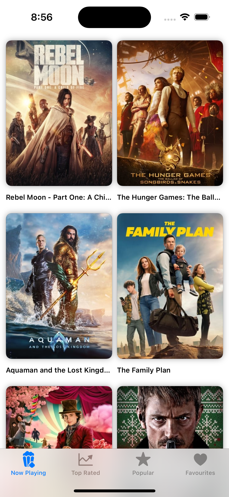
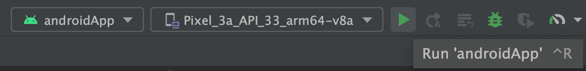

## MoviesKMM

  Jetpack Compose and SwiftUI based Kotlin Multiplatform sample project (based on [TMDB API](https://developer.themoviedb.org/)).

  <p>
      <a href = "https://developer.android.com/jetpack/androidx/releases/compose-compiler">
        
      </a>
      <a href="https://kotlinlang.org/docs/releases.html">
        
      </a>
      <a href = "https://github.com/pushpalroy/movieskmm/stargazers">
        
      </a>
      <a href = "https://github.com/pushpalroy/movieskmm/network/members">
          
      </a>
      <a href = "https://github.com/pushpalroy/movieskmm/watchers">
          
      </a>
      <a href = "https://github.com/pushpalroy/movieskmm/pulls">
         
      </a>
      <a href = "https://github.com/pushpalroy/movieskmm/issues">
          
      </a>
  </p>

### Tech stack

| Purpose         | Tool used                                                                   |
|:----------------|:----------------------------------------------------------------------------|
| Framework       | [Kotlin Multiplatform](https://kotlinlang.org/docs/multiplatform.html)      |
| Android UI      | [Jetpack Compose](https://developer.android.com/jetpack/compose)            |
| iOS UI          | [SwiftUI](https://developer.apple.com/documentation/swiftui)                |
| Lifecycle       | [KMM-ViewModel](https://github.com/rickclephas/KMM-ViewModel)               |
| Multi-threading | [KMP-NativeCoroutines](https://github.com/rickclephas/KMP-NativeCoroutines) |
| DI              | [Koin](https://insert-koin.io/docs/reference/koin-mp/kmp/)                  |
| Networking      | [KTor](https://github.com/ktorio/ktor)                                      |
| Serialization   | [Kotlinx Serialization](https://github.com/Kotlin/kotlinx.serialization)    |
| BuildConfig     | [BuildKonfig](https://github.com/yshrsmz/BuildKonfig)                       |
| Logging         | [Napier](https://github.com/AAkira/Napier)                                  |
| Lint Check      | [Detekt](https://github.com/detekt/detekt)                                  |

In this project, [KMP-NativeCoroutines](https://github.com/rickclephas/KMP-NativeCoroutines) is used, to work with flows in iOS.
It is an open-source solution that supports cancellation and generics with flows, which the Kotlin/Native compiler doesn't yet provide by default.
It helps to consume suspending functions and flows from iOS. It directly supports the async/await, Combine, and RxSwift approaches to concurrency.
KMP-NativeCoroutines has built-in support for [KMM-ViewModel](https://github.com/rickclephas/KMM-ViewModel), also used in this project to create a common ViewModel. 
Coroutines inside your KMMViewModel will (by default) use the CoroutineScope from the ViewModelScope.

## Architecture
<table style="width:100%">
  <tr>
    <td></td>
  </tr>
</table>


### Check your environment

Before you start, use the [KDoctor](https://github.com/Kotlin/kdoctor) tool to ensure that your development environment is configured correctly:

1. Install KDoctor with [Homebrew](https://brew.sh/): ``brew install kdoctor``

2. Run KDoctor in your terminal: ``kdoctor``

   If everything is set up correctly, you'll see valid output:

   ```text
   Environment diagnose (to see all details, use -v option):
   [✓] Operation System
   [✓] Java
   [✓] Android Studio
   [✓] Xcode
   [✓] Cocoapods
   
   Conclusion:
     ✓ Your system is ready for Kotlin Multiplatform Mobile development!
   ```

Otherwise, KDoctor will highlight which parts of your setup still need to be configured and will suggest a way to fix them.

### Screens

<table style="width:100%">
  <tr>
    <th>Home (iOS)</th>
    <th>Home (Android)</th>
  </tr>
  <tr>
    <td></td> 
    <td></td>
  </tr>
  <tr>
    <th>Details (iOS)</th>
    <th>Details (Android)</th>
  </tr>
  <tr>
    <td></td> 
    <td></td>
  </tr>
</table>

## Understanding the project structure

Open the project in Android Studio and switch the view from **Android** to **Project** to see all the files and targets belonging to the project:

Your Kotlin Multiplatform project includes 3 modules:

### shared

This is a Kotlin module that contains the logic common for both Android and iOS applications, that is, the code you share between platforms.

This `shared` module is also where you’ll write your Kotlin Multiplatform code.
In `shared/src/commonMain/kotlin/App.kt`, you can find the shared root `@Composable` function for your app.

It uses Gradle as the build system. You can add dependencies and change settings in `shared/build.gradle.kts`.
The `shared` module builds into an Android library and an iOS framework.

### androidApp

This is a Kotlin module that builds into an Android application. It uses Gradle as the build system.
The `androidApp` module depends on and uses the `shared` module as a regular Android library.

### iosApp

This is an Xcode project that builds into an iOS application.
It depends on and uses the `shared` module as a CocoaPods dependency.

## How to get started

Generate the API key from [The Movie Database API](https://developer.themoviedb.org), place the key in `local.properties` file as `api_read_access_token=<YOUR_API_KEY_HERE>`.

## Run your application

### On Android

To run your application on an Android emulator:

1. Ensure you have an Android virtual device available. Otherwise, [create one](https://developer.android.com/studio/run/managing-avds#createavd).
2. In the list of run configurations, select `androidApp`.
3. Choose your virtual device and click **Run**:

   

<details>
  <summary>Alternatively, use Gradle</summary>

To install an Android application on a real Android device or an emulator, run `./gradlew installDebug` in the terminal.

</details>

### On iOS

#### Running on a simulator

To run your application on an iOS simulator in Android Studio, modify the `iosApp` run configuration:

1. In the list of run configurations, select **Edit Configurations**:

   

2. Navigate to **iOS Application** | **iosApp**.
3. In the **Execution target** list, select your target device. Click **OK**.
4. The `iosApp` run configuration is now available. Click **Run** next to your virtual device.

#### Running on a real device

You can run your Kotlin Multiplatform application on a real iOS device for free.
To do so, you'll need the following:

* The `TEAM_ID` associated with your [Apple ID](https://support.apple.com/en-us/HT204316)
* The iOS device registered in Xcode

> **Note**
> Before you continue, we suggest creating a simple "Hello, world!" project in Xcode to ensure you can successfully run apps on your device.
> You can follow the instructions below or watch this [Stanford CS193P lecture recording](https://youtu.be/bqu6BquVi2M?start=716&end=1399).

<details>
<summary>How to create and run a simple project in Xcode</summary>

1. On the Xcode welcome screen, select **Create a new project in Xcode**.
2. On the **iOS** tab, choose the **App** template. Click **Next**.
3. Specify the product name and keep other settings default. Click **Next**.
4. Select where to store the project on your computer and click **Create**. You'll see an app that displays "Hello, world!" on the device screen.
5. At the top of your Xcode screen, click on the device name near the **Run** button.
6. Plug your device into the computer. You'll see this device in the list of run options.
7. Choose your device and click **Run**.

</details>

### Find this project useful ? ❤️

- Support it by clicking the ⭐️ button on the upper right of this page. ✌️

### License

```
MIT License

Copyright (c) 2024 Pushpal Roy

Permission is hereby granted, free of charge, to any person obtaining a 
copy of this software and associated documentation files (the "Software"), 
to deal in the Software without restriction, including without limitation 
the rights to use, copy, modify, merge, publish, distribute, sublicense, 
and/or sell copies of the Software, and to permit persons to whom the 
Software is furnished to do so, subject to the following conditions:

The above copyright notice and this permission notice shall be included 
in all copies or substantial portions of the Software.

THE SOFTWARE IS PROVIDED "AS IS", WITHOUT WARRANTY OF ANY KIND, EXPRESS OR 
IMPLIED, INCLUDING BUT NOT LIMITED TO THE WARRANTIES OF MERCHANTABILITY, 
FITNESS FOR A PARTICULAR PURPOSE AND NONINFRINGEMENT. IN NO EVENT SHALL THE 
AUTHORS OR COPYRIGHT HOLDERS BE LIABLE FOR ANY CLAIM, DAMAGES OR OTHER LIABILITY, 
WHETHER IN AN ACTION OF CONTRACT, TORT OR OTHERWISE, ARISING FROM, OUT OF OR IN 
CONNECTION WITH THE SOFTWARE OR THE USE OR OTHER DEALINGS IN THE SOFTWARE.
```
